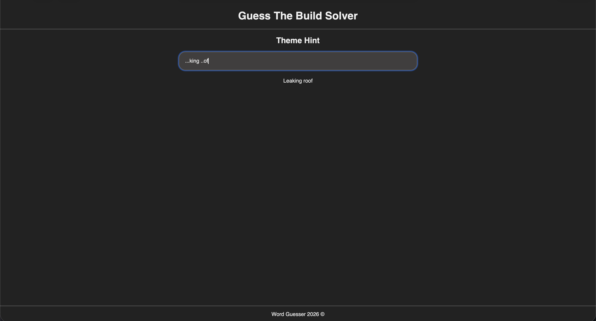
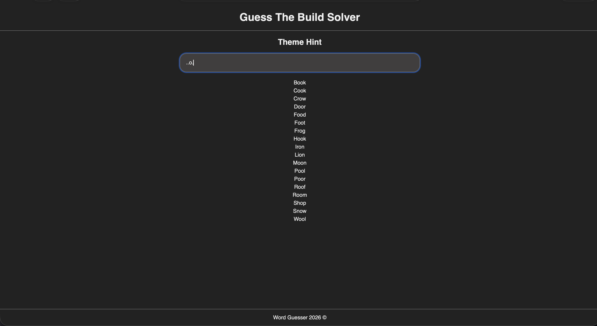

# Guess The Build Solver

A simple browser-based word guesser tool that helps users solve words using hints and regular expressions. Built with HTML, CSS, and JavaScript.

## Features

- Input hints to match words using letters, numbers, or wildcards.
- Dynamic word matching from a word list.
- Case-insensitive search.
- Clean, minimal design for quick guessing.

## Demo Examples

Here is an example of typing in a part of the "Leaking Roof" word using '.' characters as a wildcard guess.

Here is an example of typing in "..o." which is a 4 character word with only one known character. The program matches words from the list that have the letter 'o' in the same position and return it as a potential solution.

Here is a link to try out, it is not case-sensitive and still returns the same matches if either lowrcase or uppercase characters were entered. The wildcard characters in this program are considered to be non-letter characters, for example '.', ',', '?'. Additionally, the program accepts numbers as a shortcut to avoid typing in too many wildcard characters. For example, typing in "3a" treats the character '3' as a wildcard multiplied by 3, so it searches for any words that are 4 characters long and end with a character 'a'.

[Try it out by clicking this link!](https://ianabond.github.io/guess-the-build/)

## How to Use

1. Go to the link provided above.
2. Type a hint into the input box:
   - Letters will match exactly.
   - Numbers act as wildcards (e.g., `3a` → any 3 letters followed by `a`).
   - Non-letter characters like `.` or `?` are also treated as wildcards.
3. Matching words from the word list will appear below the input instantly.
